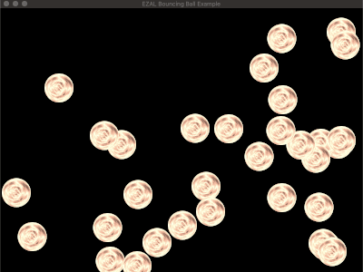

# EZAL Bouncing Ball Example
An example for the [EZ Allegro 5 Micro Game Framework](https://github.com/RichardMarks/ezal)

## Usage
1. clone repository
1. run `make && ./ezal-bouncing-ball-example`

> \*\* *It is assumed that you have already installed EZAL on your machine*

## License
© 2020, [Richard Marks](https://richardmarks.us)

MIT License (see [LICENSE.md](./LICENSE.md) for details)
